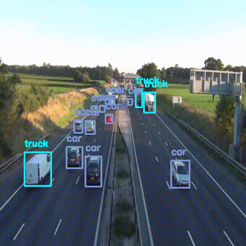
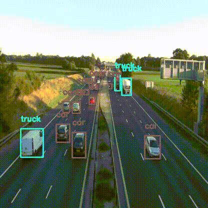
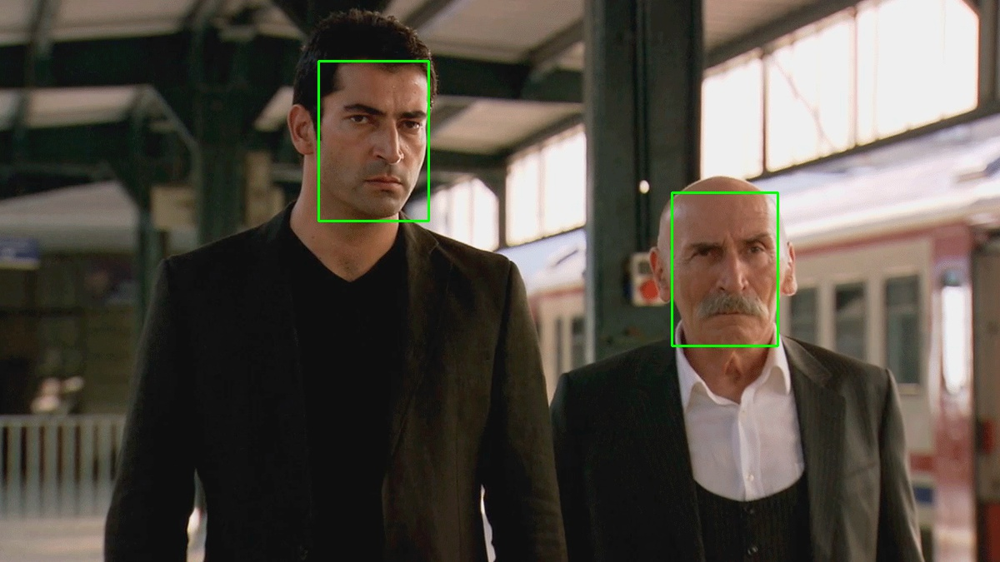
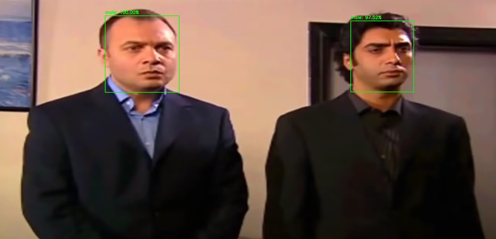

# deepvision
A simple, high level, easy-to-use open source Computer Vision library for Python.

## Installation

### Installing dependencies

Provided the below python packages are installed, deepvision is completely pip installable.

* OpenCV
* TensorFlow

If you don't have them already installed, you can install through pip

`pip install opencv-python tensorflow` 

#### Optional
or you can compile them from source if you want to enable optimizations for your specific hardware for better performance.
If you are working with GPU, you can install `tensorflow-gpu` package through `pip`. Make sure you have the necessary Nvidia drivers  installed preoperly (CUDA ToolKit, CuDNN etc). 

If you are not sure, just go with the cpu-only `tensorflow` package.

You can also compile OpenCV from source to enable CUDA optimizations for Nvidia GPU.

### Installing deepvision

`pip install deepvision` 

To upgrade to the newest version
`pip install --upgrade deepvision`

#### Optional
If you want to build deepvision from source, clone this repository and run the below commands.
```
git clone https://github.com/Lynchez/deepvision.git
cd deepvision
pip install .
```

**Note: Compatability with Python 2.x is not officially tested.**

## Object detection 
Detecting common objects in the scene is enabled through a single function call `detect_common_objects()`. It will return the bounding box co-ordinates, corrensponding labels and confidence scores for the detected objects in the image.

### Example :



```python
import deepvision as dv
from deepvision.object_detection import draw_bbox

bbox, label, conf = dv.detect_common_objects(img)

output_image = draw_bbox(img, bbox, label, conf)
```
Underneath it uses [YOLOv4](https://github.com/AlexeyAB/darknet) model trained on [COCO dataset](http://cocodataset.org/) capable of detecting 80 objects.

To enable GPU and Object Tracking
```python
from deepvision.object_tracker import Track

boxes, classes, confidence = dv.detect_common_objects(frame, confidence=0.25, model='yolov4-tiny', enable_gpu=True)

frame = Track(boxes, classes, confidence, frame)
```

Checkout `object_detection.py` in `examples` directory for the complete code.

## Object detection and Object tracking
`YOLOv4` is actually a heavy model to run on CPU. If you are working with real time webcam / video feed and doesn't have GPU, try using `tiny yolo` which is a smaller version of the original YOLO model. It's significantly fast but less accurate.



```python
bbox, label, conf = dv.detect_common_objects(img, confidence=0.25, model='yolov4-tiny')
```
Check out the [example](examples/object_detection_webcam.py) to learn more. 

Other supported models: YOLOv3, YOLOv3-tiny.

### Custom trained YOLO weights
To run inference with custom trained YOLOv3/v4 weights try the following
```python
from deepvision.object_detection import YOLO

yolo = YOLO(weights, config, labels)
bbox, label, conf = yolo.detect_objects(img)
yolo.draw_bbox(img, bbox, label, conf)
```
To enable GPU
```python
bbox, label, conf = yolo.detect_objects(img, enable_gpu=True)
```

Checkout the [example](examples/yolo_custom_weights_inference.py) to learn more.

## Object detection with TFlite 
To run inference with custom trained or pretrained weights from tensorflow hub and try the following

```python
from deepvision import TFlite

tflite = TFlite("weights.tflite", "coconames.txt")
frame = tflite.detect_objects(frame)
```

## Face detection
Detecting faces in an image is as simple as just calling the function `detect_face()`. It will return the bounding box corners and corresponding confidence for all the faces detected.
### Example :

```python
import deepvision as dv
faces, confidences = dv.detect_face(image)
```
Seriously, that's all it takes to do face detection with `deepvision`. Underneath it is using OpenCV's `dnn` module with a pre-trained caffemodel to detect faces.

To enable GPU
```python
faces, confidences = dv.detect_face(image, enable_gpu=True)
```

Checkout `face_detection.py` in `examples` directory for the complete code.

### Sample output :



## Gender detection
Once face is detected, it can be passed on to `detect_gender()` function to recognize gender. It will return the labels (man, woman) and associated probabilities.

### Example

```python
label, confidence = dv.detect_gender(face)
```

Underneath `deepvision` is using an AlexNet-like model trained on [Adience dataset](https://talhassner.github.io/home/projects/Adience/Adience-data.html#agegender) by Gil Levi and Tal Hassner for their [CVPR 2015 ](https://talhassner.github.io/home/publication/2015_CVPR) paper.

To enable GPU
```python
label, confidence = dv.detect_gender(face, enable_gpu=True)
```

Checkout `gender_detection.py` in `examples` directory for the complete code.

### Sample output :




## Utils
### Video to frames
`get_frames( )` method can be helpful when you want to grab all the frames from a video. Just pass the path to the video, it will return all the frames in a list. Each frame in the list is a numpy array.
```python
import deepvision as dv
frames = dv.get_frames('~/Downloads/demo.mp4')
```
Optionally you can pass in a directory path to save all the frames to disk.
```python
frames = dv.get_frames('~/Downloads/demo.mp4', '~/Downloads/demo_frames/')
```

### Creating gif
`animate( )` method lets you create gif from a list of images. Just pass a list of images or path to a directory containing images and output gif name as arguments to the method, it will create a gif out of the images and save it to disk for you.

```python
dv.animate(frames, '~/Documents/frames.gif')
```

## Citation
If you find deepvision helpful in your work, please cite the following
```BibTex
@misc{ar2021deepvision,
  author =       {Nurettin Sinanoğlu},
  title =        {deepvision - Easy to use Computer Vision library for Python},
  howpublished = {\url{https://github.com/Lynchez/deepvision}},
  year =         {2021}
}
```

